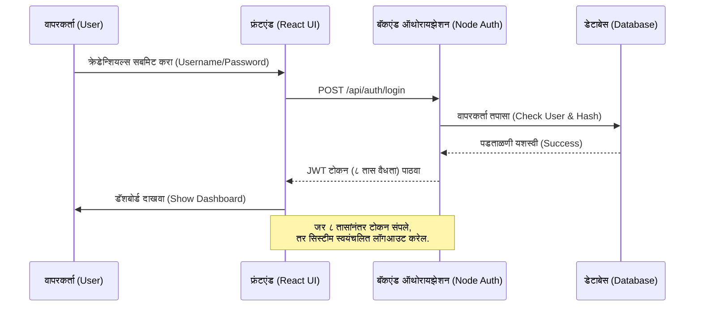
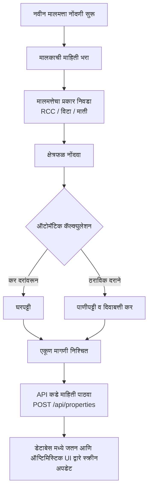

# ग्रामसारथी (Gramsarti) - प्रकल्प दस्तऐवजीकरण (Project Documentation)

हा दस्तऐवज ग्रामसारथी (Gramsarti) या ग्रामपंचायत व्यवस्थापन प्रणालीचा संपूर्ण तांत्रिक आणि कार्यात्मक आढावा (Technical and Functional Overview) प्रदान करतो. 

---

## १. तंत्रज्ञान स्टॅक (Technology Stack)

- **फ्रंटएंड (Frontend):** React (Vite), TypeScript, Tailwind CSS, Lucide React (Icons).
- **बॅकएंड (Backend):** Node.js, Express.js.
- **डेटाबेस (Database):** MySQL (मुख्य डेटाबेस) / SQLite (बॅकअप).
- **सुरक्षा (Security):** JWT Tokens (JSON Web Tokens - ८ तासांची कालबाह्यता), Bcrypt (Password Hashing).
- **परफॉर्मन्स (Performance):** Backend In-Memory Caching (API Response Optimization), Frontend Optimistic UI Updates.

---

## २. प्रणालीचे महत्त्वाचे विभाग (Core Modules)

### अ) नमुना ८ (Namuna 8) - मालमत्ता आकारणी नोंदवही
- **उद्दिष्ट:** गावातील प्रत्येक मालमत्तेची नोंद ठेवणे, घरपट्टी, पाणीपट्टी आणि इतर करांची गणना करणे.
- **वैशिष्ट्ये:**
  - एकाच ठिकाणी सर्व करांची (Property, Water, Light, etc.) स्वयंचलित बेरीज.
  - PDF स्वरूपात प्रिंट काढण्याची सुविधा (युनिफाईड प्रिंट बटण).

### ब) नमुना ९ (Namuna 9) - कर मागणी व वसुली नोंदवही
- **उद्दिष्ट:** ग्रामपंचायतीच्या वसुलीची आणि बाकीच्या करांची अचूक आकडेवारी संकलित करणे.
- **वैशिष्ट्ये:**
  - ५% सूट गणना (सप्टेंबर पूर्वी कर भरणाऱ्यांसाठी).
  - मागील बाकी आणि चालू कराची सविस्तर विभागणी.

### क) फेरफार नोंदवही (Ferfar Module)
- **उद्दिष्ट:** मालमत्तेच्या मालकी हक्कात किंवा स्वरूपात बदल झाल्यास त्याची नोंद अद्ययावत करणे.
- **वैशिष्ट्ये:**
  - खरेदी-विक्री, वारसा हक्क, बक्षीसपत्र इत्यादी व्यवहार प्रकार.
  - दुहेरी पडताळणी सिस्टीम (Dual Validation Workflow).

---

## ३. कार्यप्रवाह आलेख (Flowcharts)

### ३.१ वापरकर्ता लॉगिन आणि सुरक्षा (User Authentication Flow)

### ३.२ मालमत्ता कर आकारणी प्रक्रिया (Property Tax Flow)

---

## ४. एपीआय (API) संदर्भ पुस्तिका

| क्र. | API Endpoint | HTTP Method | वर्णन (Description) | सुरक्षा (Security) |
|---|---|---|---|---|
| १ | `/api/auth/login` | POST | वापरकर्ता लॉगिन करणे आणि JWT टोकन मिळवणे. | Public |
| २ | `/api/auth/register` | POST | नवीन वापरकर्त्याची नोंदणी करणे. | Public |
| ३ | `/api/properties` | GET | सर्व मालमत्तांची यादी आणणे (कॅश वापरून). | Authenticated |
| ४ | `/api/properties` | POST | नवीन मालमत्ता जोडणे किंवा अद्यतनित करणे. | Authenticated |
| ५ | `/api/properties/:id` | DELETE | मालमत्ता हटवणे (अधिकार असल्यास). | Authenticated |
| ६ | `/api/tax-rates` | GET | मास्टर कर दर आणणे (कॅश वापरून). | Authenticated |
| ७ | `/api/auth/users` | GET | प्रशासकासाठी सर्व वापरकर्त्यांची यादी आणणे. | Admin Only |

---

## ५. तांत्रिक सुधारणा (Technical Optimizations Applied)

1. **ऑप्टिमिस्टिक यूआय (Optimistic UI):**
   - डेटा सेव्ह किंवा डिलीट करताना सर्व्हरच्या प्रतिसादाची वाट न पाहता सिस्टीम लगेच UI अपडेट करते. जर सर्व्हरमध्ये त्रुटी आली, तरच जुना डेटा परत आणण्यात (Rollback) येतो. याने प्रणालीचा वेग खूप वाढतो.
   
2. **इन-मेमरी कॅशिंग (In-Memory Caching):**
   - `/api/tax-rates` आणि `/api/properties` ला कॅश करून डेटाबेसवर येणारा भार (Load) कमी करण्यात आला आहे. जेव्हा नवीन डेटा जोडला जातो, फक्त तेव्हाच कॅश रिसेट होतो.

3. **कोड क्लिनअप (Code Cleanup):**
   - सर्व निरुपयोगी (Useless codes) आणि वारंवार येणारे घटक (उदा. डुप्लिकेट प्रिटिंग बटणे) काढून कोड सरळ आणि हलका बनवण्यात आला आहे.

4. **सत्र समाप्ती (Session Expiry):**
   - सुरक्षिततेसाठी वापरकर्त्याचे लॉगिन सत्र कठोरपणे ८ तासांपुरते मर्यादित केले आहे. 

---
**बिल्ड आणि रन करण्यासाठी:**
- Backend: `cd server && npm start` (Port 5000)
- Frontend: `cd frontend && npm run dev` (Port 3000)
