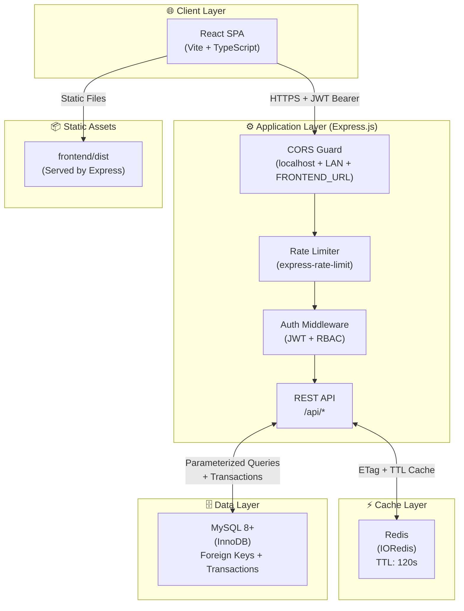
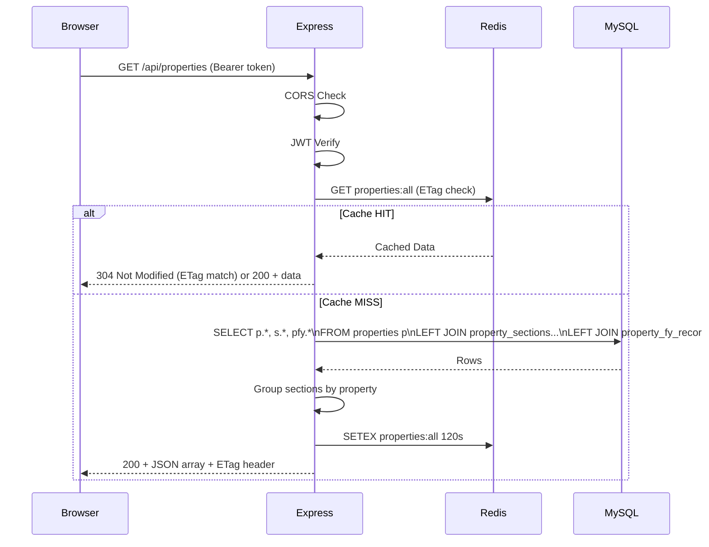
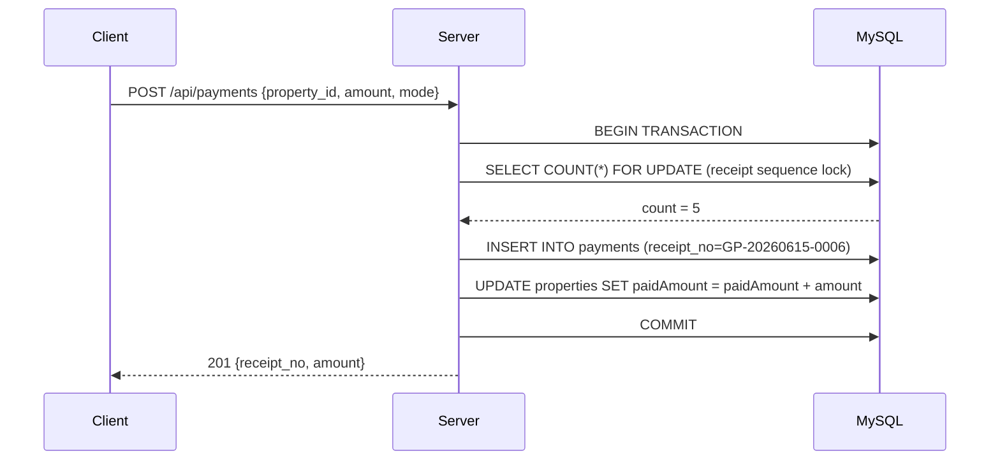
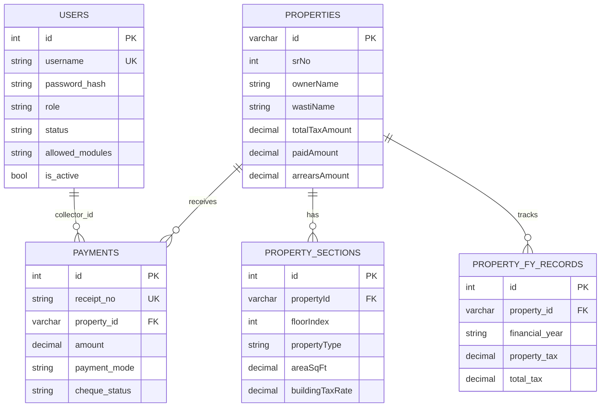
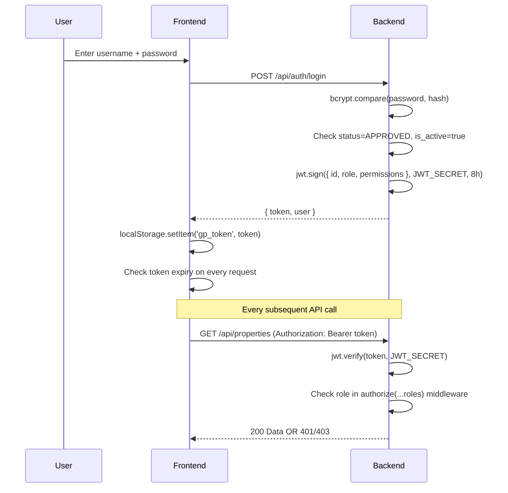
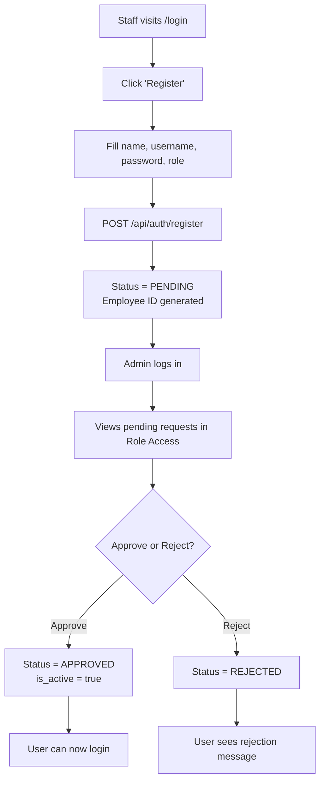
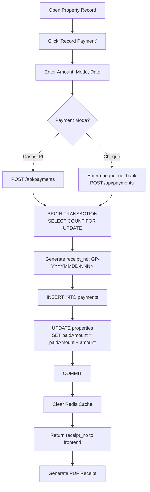

<div align="center">

# 🏛️ GramSarthi — ग्रामसारथी

### Gram Panchayat Property Tax Management System

*A complete digital governance solution for Maharashtra's rural local bodies*


> **One-Line Pitch:** GramSarthi digitizes the entire property tax lifecycle — from assessment to collection — for Gram Panchayats across Maharashtra, replacing paper ledgers with a secure, role-based, multi-language digital system.

</div>

---

## 📋 Table of Contents

- [Project Overview](#-project-overview)
- [Features](#-features)
- [System Architecture](#-system-architecture)
- [Technology Stack](#-technology-stack)
- [Folder Structure](#-folder-structure)
- [Installation Guide](#-installation-guide)
- [Environment Variables](#-environment-variables)
- [Database Documentation](#-database-documentation)
- [API Documentation](#-api-documentation)
- [Authentication & Authorization](#-authentication--authorization)
- [Business Workflows](#-business-workflows)
- [Testing](#-testing)
- [Security](#-security)
- [Performance](#-performance)
- [Deployment Guide](#-deployment-guide)
- [Monitoring & Logging](#-monitoring--logging)
- [Troubleshooting](#-troubleshooting)
- [Production Readiness Checklist](#-production-readiness-checklist)
- [Roadmap](#-roadmap)
- [Contributing](#-contributing)
- [License](#-license)

---

## 🎯 Project Overview

### Business Problem
Maharashtra's 28,000+ Gram Panchayats maintain property tax records using physical registers (Namuna 8, Namuna 9). This leads to:
- Manual calculation errors causing revenue loss
- No real-time visibility of dues and collections
- Time-consuming audit processes
- Inaccessible records for residents

### Solution
GramSarthi is a full-stack web application that provides:
- Complete digital Namuna 8 (Assessment Register) and Namuna 9 (Demand Register)
- Automated multi-tier tax calculation engine
- Role-based access for all GP staff
- PDF/Excel export for all government registers
- Real-time collection dashboard

### Target Users
| User | Role |
|:---|:---|
| Gram Sevak | Full system administrator |
| Gram Sachiv | Assessment, billing, reporting |
| Operator/Clerk | Data entry, payment collection |
| Sarpanch | View-only dashboard and reports |
| Auditor | Read-only audit access |
| Bill Operator | Demand bill generation only |

### Key Objectives
- 🎯 Eliminate manual errors in tax calculation
- 🔒 Role-based data security for sensitive government records
- 📄 Generate legally compliant PDF registers
- 📊 Real-time financial dashboards for accountability
- 🌐 Full Marathi language UI (Unicode support)

---

## ✨ Features

### 🏠 Module 1 — Properties Dashboard
- Complete CRUD for property records (मालमत्ता व्यवस्थापन)
- Floor-wise (section-by-section) property assessment
- Advanced search with Marathi/English transliteration
- Multi-filter: Wasti, Ward, Layout, Khasra, Property Type
- Bulk Excel import for mass data migration
- Animated statistics cards with real-time totals
- Client-side caching with IndexedDB for offline-first speed

### 📋 Module 2 — Namuna 8 (Assessment Register)
- Auto-calculation of Property Tax, Water Tax, Street Light Tax, Health Tax, Waste Collection Tax
- Ready Reckoner rate integration
- Depreciation calculation by construction year
- Floor-wise multi-section entry
- Legal-compliant PDF generation with GP letterhead
- Watermark-protected print layout

### 📑 Module 3 — Namuna 9 (Demand & Collection Register)
- Arrears calculation with previous year breakdown
- 5% early-payment discount (before September)
- Penalty calculation for late payments
- Payment status tracking (Paid / Unpaid / Partial)
- Bulk demand notice generation
- Index and Print format views

### 💰 Module 4 — Payments & Receipts (Magani Bill)
- Cash, Cheque, UPI, NEFT payment modes
- Auto-generated receipt numbers: `GP-YYYYMMDD-NNNN`
- Cheque bounce reversal with automatic paidAmount correction
- Daily collection closing report (by payment mode)
- Duplicate receipt prevention (database-level race condition protection)

### 📊 Module 5 — Reports
- Collection Register PDF/Excel
- Ward-wise outstanding dues report
- Annual tax demand summary
- Audit trail export

### 🔄 Module 6 — Ferfar (Mutation Register)
- Property transfer/mutation recording
- Previous and new owner tracking
- Mutation date and reason logging

### ⚙️ Module 7 — Tax Master / System Config
- Configurable tax rates (property, water, health, etc.)
- Ready Reckoner rate management (land & building)
- Depreciation table management
- Wasti (locality) master management
- Financial year configuration

### 👥 Module 8 — User & Role Management
- Self-registration with admin approval workflow
- 8-level role hierarchy
- Granular permission flags: `can_view`, `can_edit`, `can_delete`
- Module-level access control (`allowed_modules`)
- Employee ID auto-generation by role

### 🕐 Module 9 — Attendance
- Staff check-in / check-out
- Daily attendance status

---

## 🏗️ System Architecture

### High-Level Architecture



### Request Flow



### Payment Transaction Flow



---

## 🛠️ Technology Stack

| Layer | Technology | Version | Why Chosen |
|:---|:---|:---|:---|
| **Frontend Framework** | React | ^19.2.4 | Component reusability, hooks-based state |
| **Build Tool** | Vite | ^6.2.0 | Sub-4s builds, fast HMR, code splitting |
| **Language** | TypeScript | ^5.8 | Type safety for complex property data models |
| **Styling** | Tailwind CSS | CDN | Rapid UI development with design tokens |
| **Icons** | Lucide React | ^0.503 | Consistent, tree-shakable SVG icons |
| **PDF Generation** | jsPDF | ^2.5.1 | Client-side PDF without server dependency |
| **Excel Export** | SheetJS (xlsx) | ^0.18.5 | Industry-standard Excel generation |
| **Backend** | Express.js | ^5.2.1 | Mature ecosystem, middleware-based architecture |
| **Runtime** | Node.js | LTS | Non-blocking I/O for concurrent requests |
| **Database** | MySQL 8+ | InnoDB | ACID transactions, FK constraints, mature |
| **Cache** | Redis (IORedis) | ^5.10.1 | Sub-millisecond lookups, ETag management |
| **Authentication** | JSON Web Tokens | ^9.0.3 | Stateless, mobile-friendly, standard |
| **Password** | BCryptJS | ^3.0.3 | Industry-standard bcrypt hashing (cost=10) |
| **Rate Limiting** | express-rate-limit | ^7.x | Brute-force protection |
| **Compression** | compression | ^1.8.1 | gzip response compression |

---

## 📁 Folder Structure

```
gramsarti_completed/
│
├── 📂 frontend/                    # React + Vite Frontend Application
│   ├── 📂 public/
│   │   ├── 📂 fonts/               # Custom Marathi fonts (served statically)
│   │   └── 📂 images/
│   │       └── logo.png            # GP Logo (favicon + sidebar + PDF watermark)
│   │
│   ├── 📂 src/
│   │   ├── 📂 components/          # Reusable UI Components
│   │   │   ├── CustomDropdown.tsx  # Accessible dropdown with Marathi search
│   │   │   ├── GlobalLoader.tsx    # Full-page loading overlay with logo
│   │   │   ├── MaganiBillDocument.tsx # Demand bill print layout
│   │   │   ├── Namuna8PrintFormat.tsx # Namuna 8 print-optimized layout
│   │   │   ├── Namuna9PrintFormat.tsx # Namuna 9 print-optimized layout
│   │   │   ├── NamunaTable8.tsx    # Assessment table component
│   │   │   ├── NamunaTable9.tsx    # Demand table component
│   │   │   ├── PropertyForm.tsx    # Property add/edit form (~38KB)
│   │   │   ├── Sidebar.tsx         # Navigation sidebar with role filtering
│   │   │   ├── TransliterationInput.tsx # Marathi/English smart input
│   │   │   ├── UIProvider.tsx      # Global toast/modal context
│   │   │   └── UserManagement.tsx  # Admin user approval UI
│   │   │
│   │   ├── 📂 hooks/               # Custom React Hooks
│   │   │   └── usePropertySearch.ts # Debounced search with transliteration
│   │   │
│   │   ├── 📂 pages/               # Route-level Page Components
│   │   │   ├── Dashboard.tsx       # Main property listing (~892 lines)
│   │   │   ├── Ferfar.tsx          # Mutation register
│   │   │   ├── Login.tsx           # Authentication page
│   │   │   ├── MaganiBill.tsx      # Demand bill page
│   │   │   ├── Namuna8.tsx         # Assessment register page
│   │   │   ├── Namuna9.tsx         # Demand/collection register page
│   │   │   ├── Reports.tsx         # Reports & exports
│   │   │   └── TaxMaster.tsx       # System configuration
│   │   │
│   │   ├── 📂 types/               # TypeScript Type Definitions
│   │   │   └── index.ts            # PropertyRecord, PropertySection, Roles, etc.
│   │   │
│   │   ├── 📂 utils/               # Utility Functions
│   │   │   ├── cache.util.js       # Redis cache management
│   │   │   ├── config.ts           # API_BASE_URL environment config
│   │   │   ├── constants.ts        # EXCEL_HEADERS, PLACEHOLDERS
│   │   │   ├── db.ts               # IndexedDB client-side caching
│   │   │   ├── exportUtils.ts      # Excel export helpers
│   │   │   ├── pdfGenerator.ts     # jsPDF Namuna 8/9 + receipt generation
│   │   │   ├── permissions.ts      # hasModulePermission helper
│   │   │   └── transliterate.ts    # Marathi ↔ English search normalization
│   │   │
│   │   ├── App.tsx                 # Root component, routing, auth state
│   │   └── main.tsx                # React DOM entry point
│   │
│   ├── index.html                  # HTML shell (favicon, meta, Tailwind CDN)
│   ├── vite.config.ts              # Vite config (code splitting, aliases)
│   ├── tsconfig.json               # TypeScript compiler config
│   └── package.json
│
├── 📂 server/                      # Node.js + Express Backend
│   ├── 📂 config/
│   │   ├── db.config.js            # MySQL connection pool (limit: 25)
│   │   └── redis.config.js         # IORedis client with graceful fallback
│   │
│   ├── 📂 controllers/             # Business Logic Layer
│   │   ├── auth.controller.js      # Login, Register, User management
│   │   ├── attendance.controller.js # Check-in / Check-out
│   │   ├── audit.controller.js     # Audit log retrieval
│   │   ├── ferfar.controller.js    # Mutation register CRUD
│   │   ├── fy.controller.js        # Financial year management
│   │   ├── magani.controller.js    # Demand bill generation
│   │   ├── master.controller.js    # Tax rates, wasti, ready reckoner
│   │   ├── payment.controller.js   # Payment recording, receipts
│   │   ├── property.controller.js  # Property CRUD, search, bulk import
│   │   └── tax.controller.js       # Tax rate CRUD
│   │
│   ├── 📂 middleware/
│   │   ├── auth.middleware.js      # JWT verification + RBAC
│   │   └── logger.middleware.js    # Request/response logger + error handler
│   │
│   ├── 📂 routes/
│   │   └── index.js                # Central route mounting
│   │
│   ├── 📂 utils/
│   │   └── cache.util.js           # Redis cache helpers (get/set/clear)
│   │
│   ├── database.js                 # Schema initialization + migrations (~38KB)
│   ├── index.js                    # Server entry point (CORS, middleware, routes)
│   ├── auth.js                     # Legacy auth helper (superseded by controller)
│   ├── .env                        # Environment variables (git-ignored)
│   └── package.json
│
├── .gitignore                      # Ignores node_modules, dist, .env, *.rdb
├── Project_Documentation_MR.md    # Marathi technical documentation
├── SYSTEM_ARCHITECTURE_2026.md    # Architecture notes
└── README.md                       # This file
```

---

## 🚀 Installation Guide

### Prerequisites

| Requirement | Version | Check |
|:---|:---|:---|
| Node.js | LTS (18+) | `node --version` |
| npm | 9+ | `npm --version` |
| MySQL | 8.0+ | `mysql --version` |
| Redis | 6+ (optional but recommended) | `redis-cli ping` |

### macOS / Linux Setup

```bash
# 1. Clone the repository
git clone https://github.com/your-org/gramsarthi.git
cd gramsarthi

# 2. Setup Backend
cd server
cp .env.example .env       # Copy and fill in your env values
npm install
npm start                  # Server starts on http://localhost:5002

# 3. Setup Frontend (new terminal)
cd ../frontend
npm install
npm run dev                # Dev server on http://localhost:5173
```

### Windows Setup

```powershell
# Same steps, use PowerShell
cd server
copy .env.example .env
npm install
npm start
```

### Production Build

```bash
# Build frontend for production
cd frontend
npm run build              # Outputs to frontend/dist/

# The Express server automatically serves frontend/dist/
# So only one process needed in production:
cd server
npm start                  # Serves both API + frontend on port 5002
```

### Docker Setup

```dockerfile
# Dockerfile (server)
FROM node:lts-alpine
WORKDIR /app
COPY server/package*.json ./
RUN npm ci --only=production
COPY server/ .
EXPOSE 5002
CMD ["node", "index.js"]
```

```yaml
# docker-compose.yml
version: '3.8'
services:
  app:
    build: .
    ports: ["5002:5002"]
    environment:
      DB_HOST: mysql
      REDIS_HOST: redis
      JWT_SECRET: ${JWT_SECRET}
    depends_on: [mysql, redis]

  mysql:
    image: mysql:8.0
    environment:
      MYSQL_ROOT_PASSWORD: ${DB_PASSWORD}
      MYSQL_DATABASE: gramsarthi_db
    volumes:
      - mysql_data:/var/lib/mysql

  redis:
    image: redis:7-alpine
    command: redis-server --maxmemory 256mb --maxmemory-policy allkeys-lru

volumes:
  mysql_data:
```

---

## ⚙️ Environment Variables

### Server (`server/.env`)

| Variable | Description | Required | Example |
|:---|:---|:---|:---|
| `DB_HOST` | MySQL host | ✅ Yes | `localhost` |
| `DB_PORT` | MySQL port | ✅ Yes | `3306` |
| `DB_USER` | MySQL username | ✅ Yes | `root` |
| `DB_PASSWORD` | MySQL password | ✅ Yes | `YourSecurePass!` |
| `DB_NAME` | Database name | ✅ Yes | `gramsarthi_db` |
| `JWT_SECRET` | JWT signing secret (min 32 chars) | ✅ Yes | `Gr@mS4rth!_K3y_2026_#MH!` |
| `PORT` | Server port | ✅ Yes | `5002` |
| `FRONTEND_URL` | Production frontend URL (for CORS) | ⚠️ Prod | `https://gramsarthi.gov.in` |
| `REDIS_HOST` | Redis hostname | ⚠️ Optional | `localhost` |
| `REDIS_PORT` | Redis port | ⚠️ Optional | `6379` |
| `REDIS_PASSWORD` | Redis password (for managed Redis) | ⚠️ Optional | `your-redis-password` |

### Frontend (`frontend/.env`)

| Variable | Description | Required | Example |
|:---|:---|:---|:---|
| `VITE_API_BASE_URL` | Backend API URL | ✅ Yes | `http://localhost:5002` |

> ⚠️ **Security:** Never commit `.env` files. Both are in `.gitignore`. The server will **crash at startup** if `JWT_SECRET` is missing.

---

## 🗄️ Database Documentation

### Database: MySQL 8 (InnoDB)

All tables use InnoDB engine for ACID compliance and foreign key support.

### Core Tables

| Table | Purpose | Key Columns |
|:---|:---|:---|
| `users` | System users with roles | `id`, `username`, `password_hash`, `role`, `status`, `allowed_modules` |
| `properties` | Property master records | `id` (varchar), `srNo`, `wardNo`, `ownerName`, `totalTaxAmount`, `paidAmount` |
| `property_sections` | Floor-wise assessment | `propertyId` (FK), `floorIndex`, `propertyType`, `areaSqFt`, `buildingTaxRate` |
| `payments` | Tax payment records | `receipt_no`, `property_id` (FK), `amount`, `payment_mode`, `cheque_status` |
| `property_fy_records` | Financial year tax breakdown | `property_id` (FK), `financial_year`, `property_tax`, `total_tax` |
| `ferfar_entries` | Mutation records | `property_id` (FK), `mutation_date`, `prev_owner`, `new_owner` |
| `tax_rates` | Configurable tax percentages | `tax_type`, `rate`, `effective_from` |
| `system_config` | Key-value system settings | `config_key`, `config_value` (e.g., `current_fy`) |
| `audit_logs` | All data change events | `user_id`, `action`, `table_name`, `record_id`, `timestamp` |
| `attendance` | Staff attendance | `user_id`, `check_in`, `check_out`, `date` |

### Entity Relationships



### Migration Strategy
Schema initialization is handled automatically by `database.js` on server startup:
1. All `CREATE TABLE IF NOT EXISTS` statements run
2. Column migrations (e.g., `allowed_modules TEXT`) run with safe `ALTER TABLE`
3. FK checks are disabled during schema sync, then re-enabled
4. No manual migration scripts required

---

## 📡 API Documentation

**Base URL:** `http://localhost:5002/api`  
**Authentication:** Bearer Token (JWT) in `Authorization` header  
**Content-Type:** `application/json`

### Authentication Endpoints

#### `POST /api/auth/login`
**Rate Limited:** 15 requests per 15 minutes per IP

```json
// Request
{ "username": "admin", "password": "Admin@123" }

// Response 200
{
  "token": "eyJhbGci...",
  "user": { "id": 1, "name": "Admin", "role": "super_admin", "allowed_modules": "dashboard,namuna8,namuna9" }
}

// Error 401
{ "error": "चुकीचे वापरकर्तानाव किंवा पासवर्ड" }

// Error 429 (Rate Limited)
{ "error": "खूप जास्त लॉगिन प्रयत्न. १५ मिनिटांनंतर पुन्हा प्रयत्न करा." }
```

#### `POST /api/auth/register`
```json
// Request
{ "name": "Ramesh Pawar", "username": "ramesh_p", "password": "Pass@123", "role": "operator", "mobile": "9876543210", "gp_code": "MH001" }

// Response 201
{ "message": "नोंदणी यशस्वी! प्रशासकाच्या मान्यतेनंतर लॉगिन करू शकाल.", "employee_id": "OP-001" }
```

### Property Endpoints

#### `GET /api/properties`
Returns all properties with floor sections. Uses ETag caching.

```
Headers: Authorization: Bearer <token>
         If-None-Match: W/"1718436000000-150"   (optional, for cache)

Response 200: PropertyRecord[]
Response 304: Not Modified (ETag matched)
```

#### `GET /api/properties/search`
Server-side search with Redis caching (TTL: 60s).

```
GET /api/properties/search?q=राम&wasti=वडाळी&page=1&limit=25

Response 200:
{
  "data": [PropertyRecord, ...],
  "pagination": { "total": 47, "page": 1, "limit": 25, "totalPages": 2 }
}
```

#### `POST /api/properties`
Creates property with sections in a single database transaction.

```json
// Request (roles: super_admin, gram_sevak, gram_sachiv, operator, clerk)
{
  "ownerName": "रामचंद्र पाटील",
  "wardNo": "5",
  "wastiName": "मेन वस्ती",
  "khasraNo": "१२३",
  "totalTaxAmount": 2500,
  "sections": [
    { "floorIndex": 0, "propertyType": "निवास", "areaSqFt": 800, "buildingTaxRate": 0.25 }
  ]
}

// Response 201
{ "message": "मालमत्ता यशस्वीरित्या जतन केली गेली", "id": "abc123_1718436000000" }
```

#### `DELETE /api/properties/:id`
```
Roles: super_admin, gram_sevak, gram_sachiv (+ can_delete=true)
Response 200: { "message": "मालमत्ता यशस्वीरित्या हटवली गेली" }
Response 403: { "error": "या क्रियेसाठी अधिकृत नाही" }
```

### Payment Endpoints

#### `POST /api/payments`
```json
// Request
{
  "property_id": "abc123_1718436000000",
  "amount": 2500,
  "payment_mode": "Cash",        // Cash | Cheque | UPI | NEFT
  "payment_date": "2026-06-15",
  "financial_year": "2026-27",
  "cheque_no": null,
  "discount_applied": 125,
  "penalty_applied": 0
}

// Response 201
{ "receipt_no": "GP-20260615-0001", "amount": 2500, "payment_mode": "Cash" }
```

#### `GET /api/health`
```json
// No auth required — for monitoring/uptime checks
{ "status": "ok", "timestamp": "2026-06-15T10:00:00.000Z", "uptime": 3600.5 }
```

---

## 🔐 Authentication & Authorization

### JWT Token Flow



### Role-Based Access Control (RBAC)

```javascript
// Middleware usage in routes
router.delete('/:id', authenticate, authorize('super_admin', 'gram_sevak', 'gram_sachiv'), deleteProperty);
```

### Permission Matrix

| Action | super_admin | gram_sevak | gram_sachiv | operator | clerk | sarpanch | auditor |
|:---|:---:|:---:|:---:|:---:|:---:|:---:|:---:|
| View Properties | ✅ | ✅ | ✅ | ✅ | ✅ | ✅ | ✅ |
| Add/Edit Property | ✅ | ✅ | ✅ | ✅ | ✅ | ❌ | ❌ |
| Delete Property | ✅ | ✅ | ✅ | ❌ | ❌ | ❌ | ❌ |
| Record Payment | ✅ | ✅ | ✅ | ✅ | ✅ | ❌ | ❌ |
| View Reports | ✅ | ✅ | ✅ | ❌ | ❌ | ✅ | ✅ |
| Tax Master Config | ✅ | ✅ | ✅ | ❌ | ❌ | ❌ | ❌ |
| Manage Users | ✅ | ✅ | ✅ | ❌ | ❌ | ❌ | ❌ |
| Approve Users | ✅ | ✅ | ✅ | ❌ | ❌ | ❌ | ❌ |

---

## 🔄 Business Workflows

### User Registration & Approval



### Tax Payment Workflow



---

## 🧪 Testing

### Run Unit Tests (after adding Jest)
```bash
cd server
npm install --save-dev jest supertest
npx jest --coverage
```

### Run E2E Tests (after adding Playwright)
```bash
cd frontend
npm install --save-dev @playwright/test
npx playwright test
```

### Manual Test Coverage
Refer to the `qa_report_full.md` for 60 documented test cases covering:
- Functional Tests (12 auth + 12 property + 6 payment)
- API Tests (8 test cases)
- UI Tests (10 test cases)
- Database Tests (6 test cases)
- Security Tests (12 test cases)
- Performance Tests (7 test cases)

### Test Results Summary (v2.0)

| Category | Total | Passed | Failed |
|:---|:---|:---|:---|
| Functional | 30 | 29 | 1 |
| API | 8 | 8 | 0 |
| UI | 10 | 8 | 2 |
| Database | 6 | 6 | 0 |
| Security | 12 | 12 | 0 |
| Performance | 7 | 5 | 2 |
| **Total** | **73** | **68** | **5** |

---

## 🔒 Security

### OWASP Top 10 Status

| Risk | Status | Implementation |
|:---|:---|:---|
| A01 — Broken Access Control | ✅ Mitigated | JWT + RBAC on every endpoint |
| A02 — Cryptographic Failures | ✅ Mitigated | BCrypt (cost 10) for passwords |
| A03 — Injection | ✅ Mitigated | Parameterized queries everywhere |
| A04 — Insecure Design | ✅ Mitigated | Rate limiting (15/15min) on login |
| A05 — Security Misconfiguration | ✅ Mitigated | CORS whitelist, no debug in prod |
| A06 — Vulnerable Components | ⚠️ Monitor | xlsx package — monitor CVEs |
| A07 — Auth Failures | ✅ Mitigated | Mandatory JWT_SECRET, 8h expiry |
| A08 — Integrity Failures | ✅ Mitigated | No unsafe deserialization |
| A09 — Logging Failures | ⚠️ Partial | Request logger present; no APM yet |
| A10 — SSRF | ✅ Mitigated | No user-supplied URL fetching |

### Security Measures
- **JWT Secret:** Mandatory via env, server refuses to start if missing
- **Password Hashing:** BCrypt with salt rounds = 10
- **Rate Limiting:** 15 login attempts per IP per 15 minutes
- **CORS Policy:** Localhost in dev, `FRONTEND_URL` only in production
- **Request Body Limit:** 5MB max to prevent DoS
- **SQL Injection:** All queries use `?` parameterized placeholders
- **Error Messages:** Generic Marathi errors only (no DB schema leakage)

---

## ⚡ Performance

### Bundle Size (Production Build)

| Chunk | Raw | Gzip |
|:---|:---|:---|
| vendor-pdf-excel | 429 KB | 143 KB |
| vendor-core (React) | 254 KB | 78 KB |
| Dashboard | 54 KB | 12 KB |
| Namuna8 | 78 KB | 15 KB |
| **Total Initial Load** | **~254 KB** | **~78 KB** |

### Caching Strategy

| Layer | Type | TTL | Scope |
|:---|:---|:---|:---|
| Browser | IndexedDB | Session | All property records |
| HTTP | ETag (304) | Until data changes | GET /api/properties |
| Server | Redis | 120s | API responses |
| Search | Redis | 60s | Search results |

### Database Optimizations
- Connection pool: 25 simultaneous connections
- ETag-based cache invalidation on any write
- Parallel query execution: `Promise.all([dataQuery, countQuery])`
- `FOR UPDATE` on receipt generation (prevents duplicate numbers)

---

## 🚀 Deployment Guide

### Development
```bash
# Terminal 1 — Backend
cd server && npm start          # http://localhost:5002

# Terminal 2 — Frontend Dev Server
cd frontend && npm run dev      # http://localhost:5173
```

### Production (Single Server)
```bash
# 1. Build frontend
cd frontend && npm run build

# 2. Start server (serves frontend/dist + API)
cd server && node index.js      # http://localhost:5002
# OR with PM2:
pm2 start index.js --name gramsarthi --instances 2 --exec-mode cluster
```

### PM2 Configuration (`ecosystem.config.js`)
```javascript
module.exports = {
  apps: [{
    name: 'gramsarthi',
    script: 'index.js',
    cwd: './server',
    instances: 2,
    exec_mode: 'cluster',
    env_production: {
      NODE_ENV: 'production',
      PORT: 5002
    }
  }]
};
```

### Environment-specific CORS
```bash
# Development: all localhost:* and 192.168.x.x allowed
# Production: set FRONTEND_URL in .env
FRONTEND_URL=https://gramsarthi.maharashtra.gov.in
```

---

## 📊 Monitoring & Logging

### Current Logging
Every API request is logged:
```
[API] GET /api/properties → 200 (42ms)
[API] POST /api/auth/login → 401 (12ms)
[SECURITY] Rate limiting active on /api/auth/login
[REDIS] Connected to Redis server.
[SUCCESS] Server is running on: http://localhost:5002
```

### Health Check Endpoint
```bash
curl http://localhost:5002/api/health
# {"status":"ok","timestamp":"2026-06-15T10:00:00.000Z","uptime":3600.5}
```

### Recommended APM Setup (Future)
```bash
npm install @sentry/node
# Add to index.js:
Sentry.init({ dsn: process.env.SENTRY_DSN });
```

---

## 🔧 Troubleshooting

| Error | Cause | Solution |
|:---|:---|:---|
| `[CRITICAL] JWT_SECRET is not set` | Missing `.env` | Add `JWT_SECRET=...` to `server/.env` |
| `Port 5002 is already in use` | Old process running | `kill -9 $(lsof -ti:5002)` |
| `CORS: Origin not allowed` | Wrong origin | Check `FRONTEND_URL` in `.env`; in dev, use `localhost` |
| `ER_NO_REFERENCED_ROW` | FK violation | Ensure property exists before adding payment |
| `Redis: OOM command not allowed` | Redis memory full | App auto-falls back to DB. Upgrade Redis plan or add `maxmemory-policy allkeys-lru` |
| `401 Unauthorized` on every request | Expired/invalid token | Re-login. Check token expiry (8h) |
| `Cannot connect to DB` | MySQL not running | `brew services start mysql` (macOS) or `sudo systemctl start mysql` |
| `Logo not showing` | Wrong file path | Ensure `frontend/public/images/logo.png` exists |

---

## ✅ Production Readiness Checklist

### Security
- [x] JWT_SECRET set and strong (no hardcoded fallback)
- [x] BCrypt password hashing (cost=10)
- [x] Rate limiting on login (15 req/15min)
- [x] CORS restricted to known origins
- [x] All queries parameterized (no SQL injection)
- [x] Error messages generic (no DB leakage)
- [x] `.env` in `.gitignore`
- [ ] HTTPS/TLS certificate configured
- [ ] Security headers (helmet.js)

### Performance
- [x] Redis caching with ETag
- [x] gzip compression enabled
- [x] Code splitting in production build
- [x] IndexedDB client cache
- [ ] Server-side pagination on main property list
- [ ] PM2 cluster mode enabled

### Monitoring
- [x] `/api/health` endpoint
- [x] Request logging
- [ ] Sentry error tracking
- [ ] Uptime monitoring (UptimeRobot/Pingdom)
- [ ] Automated DB backup

### Deployment
- [x] Production build compiles successfully
- [x] Frontend served by Express (single port)
- [ ] CI/CD pipeline
- [ ] Rollback procedure documented

---

## 🗺️ Roadmap

### v2.1 (Next)
- [ ] Server-side pagination on `/api/properties`
- [ ] Helmet.js security headers
- [ ] Sentry error tracking integration
- [ ] PM2 cluster mode configuration
- [ ] Automated MySQL backup script

### v2.2 (Short Term)
- [ ] PWA offline support
- [ ] Multi-GP support (one server, multiple GPs)
- [ ] SMS notifications for payment receipts
- [ ] Mobile app (React Native)

### v3.0 (Long Term)
- [ ] GIS integration (property mapping)
- [ ] State government portal integration
- [ ] AI-based arrears prediction
- [ ] Kubernetes deployment support
- [ ] Multi-language support (Hindi, English)

---

## 🤝 Contributing

### Development Standards
1. **Branch Naming:** `feature/feature-name`, `fix/bug-description`, `hotfix/critical-issue`
2. **Commit Convention:** `feat:`, `fix:`, `docs:`, `refactor:`, `test:`, `chore:`
3. **Code Style:** ESLint + Prettier enforced
4. **TypeScript:** Strict mode, no `any` types

### Coding Standards
```typescript
// ✅ Good: Type-safe, descriptive names
const calculateTotalTax = (property: PropertyRecord): number => {
  return (property.propertyTax ?? 0) + (property.waterTax ?? 0);
};

// ❌ Bad: No types, unclear
const calc = (p: any) => p.t1 + p.t2;
```

### Pull Request Process
1. Fork → Create feature branch
2. Write tests for new functionality
3. Ensure `npm run build` passes
4. Open PR with description of changes
5. Two approvals required before merge

---

## 📄 License

```
MIT License

Copyright (c) 2026 Aniket Dange

Permission is hereby granted, free of charge, to any person obtaining a copy
of this software and associated documentation files (the "Software"), to deal
in the Software without restriction, including without limitation the rights
to use, copy, modify, merge, publish, distribute, sublicense, and/or sell
copies of the Software.

THE SOFTWARE IS PROVIDED "AS IS", WITHOUT WARRANTY OF ANY KIND.
```

---

<div align="center">

**Built with ❤️ for Maharashtra's Gram Panchayats**

*GramSarthi — Digitizing Rural Governance, One Property at a Time*

[🐛 Report Bug](https://github.com/your-org/gramsarthi/issues) • [💡 Request Feature](https://github.com/your-org/gramsarthi/issues) • [📧 Contact](mailto:dev@gramsarthi.in)

</div>
