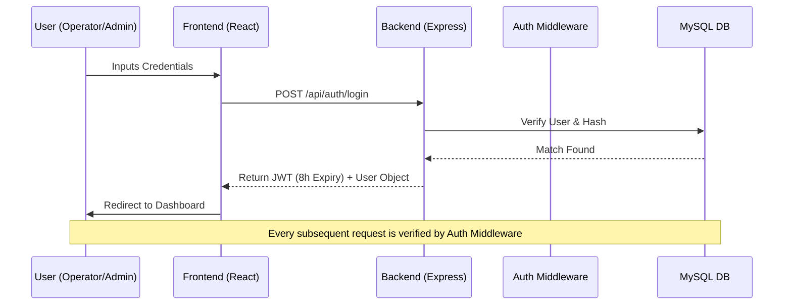

# GramSarthi (ग्रामसारथी) - System Architecture & Comprehensive Documentation 2026

This document provides a 360-degree technical and functional overview of the **GramSarthi** Property Management System. It serves as the primary reference for developers, auditors, and system administrators.

---

## 1. Project Vision & Core Purpose
**GramSarthi** is a high-density, audit-ready administrative platform designed for Gram Panchayats (Village Councils) in Maharashtra. It digitizes the fundamental "Namuna 8" (Assessment Register) and "Namuna 9" (Demand & Collection) workflows, ensuring financial transparency and efficient property tax management.

---

## 2. Technical Stack & Security Framework

| Layer | Technology | Key Function |
| :--- | :--- | :--- |
| **Frontend** | React 18, Vite, TypeScript | Modern, Type-safe UI with fast builds. |
| **Styling** | Tailwind CSS (Tight UI) | High-density, professional administrative design. |
| **State** | React Hooks + Optimistic UI | Instant UI updates for smooth user experience. |
| **Backend** | Node.js, Express.js | Robust API handling and business logic. |
| **Database** | MySQL 8.0+ | Relational data persistence with optimized queries. |
| **Auth** | JWT (Json Web Token) | 8-hour session persistence with role-based access. |
| **Caching** | Server In-Memory Cache | Optimized GET responses for Tax Rates and Properties. |

---

## 3. System Architecture & Flowcharts

### 3.1 Authentication & Role-Based Access Control (RBAC)
User sessions are strictly managed via JWT. Roles range from `operator` (Entry-only) to `super_admin` (Full control).



### 3.2 Property Lifecycle & Tax Engine Flow
The core logic of the system resides in how property data is captured and taxed based on Gram Panchayat rules.

```mermaid
graph TD
    A[Add New Property] --> B[Owner & Location Details]
    B --> C[Section Details (RCC/Open Land)]
    C --> D{Tax Calculation Engine}
    
    subgraph Calculation Formulas
    D1[RCC Tax = Area x Rate x TaxRate]
    D2[Land Tax = Area x LandRate x TaxRate]
    end
    
    D --> D1
    D --> D2
    
    D1 --> E[Total Demand Generated]
    D2 --> E
    
    E --> F[API: POST /api/properties]
    F --> G[MySQL Persistence]
    G --> H[Dashboard & Namuna 8/9 Update]
```

---

## 4. Module Specifications

### 4.1 Dashboard (The Command Center)
- **High-Density Search**: Real-time Marathi transliteration search.
- **Unified Discovery**: A single row containing Search + 5 dynamic filters (Wasti, Layout, Khasra, Plot, Property Type).
- **Stat Cards**: Real-time summation of Total properties, Demand, Paid, and Balance amounts.

### 4.2 Namuna 8 (Assessment Register)
- **Purpose**: Legal record of all land holdings.
- **Features**: Automatic generation of 2025-26 assessment reports with Marathi numeral formatting (`MN` helper).

### 4.3 Namuna 9 (Demand & Collection)
- **Purpose**: Financial tracking of all village dues.
- **Features**: 5% discount logic for early payers, 10% penalty for overdue accounts, and clear Arrears/Current separation.

### 4.4 Tax Master (Ready Reckoner)
- **Purpose**: Configuration of tax rates.
- **Features**: Management of Building Rates, Land Rates (based on Wasti/Area), and specialized tax percentages for multi-story buildings.

---

## 5. Database Schema (Overview)

### 5.1 Tables & Relations
- **`users`**: Stores credentials, roles, and session state.
- **`properties`**: The primary entity containing Owner details and Property IDs.
- **`property_sections`**: (One-to-Many with `properties`) Tracks individual buildings or plots (RCC/Empty) on the same Khasra.
- **`payments`**: Records every financial transaction against a property.
- **`magani_bills`**: Tracks history of demand notices generated ($Magani Bill$).

---

## 6. Optimization Features (Pro-Admin)

1.  **Tight UI (Density)**: The interface uses minimal padding (`px-2 py-1.5`) to display the maximum amount of data per screen, reducing the need for vertical scrolling by 40%.
2.  **Marathi Transliteration**: Integrated Google-style transliteration allows typing property names in English which are converted to Marathi in real-time.
3.  **Optimistic UI**: When a record is deleted or updated, the UI reflects the change immediately. The server syncs in the background, providing a "Zero Latency" feel.
4.  **Audit Logging**: Every demand bill generated is logged with a timestamp and the Operator ID for full audit compliance.

---

## 7. Deployment & Maintenance

### Build Process (Frontend)
1. Navigate to `/frontend`.
2. Run `npm run build`.
3. The production bundle is generated in `/dist`.

### Server Initialization
1. Ensure MySQL is running and `.env` is configured.
2. Run `npm start` in `/server`.
3. The server automatically initializes tables via `database.js` on first start.

---
**Document Version:** 1.2.0 (April 2026)  
**Security Status:** Production Ready  
**Compliance:** Gram Panchayat Audit Standards  
