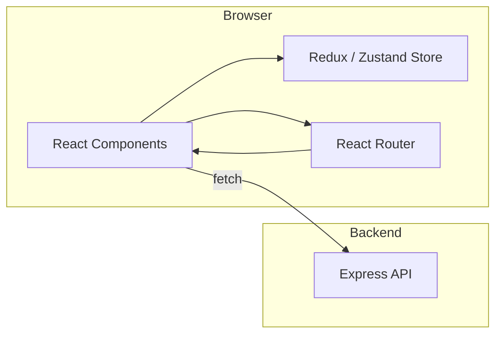

# Frontend README – GramSarthi v2.0

> **Project:** GramSarthi – Maharashtra Gram Panchayat Tax Management System
> **Module:** Frontend (React + Vite)

---

## 📦 Overview
The frontend is a modern **React** single‑page application built with **Vite** (TypeScript). It delivers an intuitive, responsive UI for Panchayat officials and citizens to view tax data, submit payments, generate reports, and interact with the backend services. The UI follows the **Material‑UI** design system with custom theming and a dark‑mode ready, accessible layout.

## 🏗️ Architecture Diagram


## 🛠️ Tech Stack
| Category | Tool | Reason |
|---|---|---|
| Runtime | **Node.js 18** | Consistent with backend LTS |
| Build Tool | **Vite** | Lightning‑fast dev server & ESM support |
| Framework | **React 18** | Component‑driven UI, hooks, concurrent rendering |
| Language | **TypeScript** | Type safety, IDE autocompletion |
| Styling | **CSS Modules** + **Vanilla CSS** | Fine‑grained control, no heavy frameworks |
| UI Library | **Material‑UI (MUI)** | Pre‑built, accessible components |
| State Management | **Zustand** (lightweight) | Simple store, no boilerplate |
| Routing | **React Router v6** | Declarative nested routes |
| Testing | **Jest** + **React Testing Library** | Unit + component testing |
| E2E | **Cypress** | End‑to‑end user flow testing |
| Linting | **ESLint** + **Prettier** | Code consistency |
| Accessibility | **axe-core**, **eslint-plugin-jsx-a11y** | WCAG compliance |
| Performance Audits | **Lighthouse** (CI) | Automated performance metrics |

## 📂 Folder Structure
```
frontend/
├─ public/               # Static assets (logo.png, favicon, etc.)
│   └─ images/
│       └─ logo.png      # Project logo (used in header & favicon)
├─ src/                  # Source code (TSX)
│   ├─ assets/           # Images, icons, fonts
│   ├─ components/       # Reusable UI components
│   ├─ pages/            # Route‑level page components
│   ├─ hooks/            # Custom React hooks
│   ├─ store/            # Zustand store definitions
│   ├─ utils/            # Helper functions (API client, formatters)
│   ├─ App.tsx           # Root component
│   └─ main.tsx          # React entry point
├─ tests/                # Jest + RTL unit tests
├─ e2e/                  # Cypress integration tests
├─ .env.example          # Sample environment variables
├─ vite.config.ts        # Vite configuration (aliases, plugins)
├─ tsconfig.json         # TypeScript config
├─ package.json          # Dependencies & scripts
└─ README.md             # **THIS FILE**
```

## ⚙️ Setup & Development
1. **Clone** the repository and `cd` into `frontend/`.
2. **Copy** `.env.example` → `.env` and configure:
   ```bash
   VITE_API_URL=http://localhost:5002/api   # Backend URL
   VITE_LOGO_PATH=/images/logo.png           # Path to logo asset
   ```
3. **Install** dependencies:
   ```bash
   npm ci
   ```
4. **Start** the dev server with hot‑module replacement:
   ```bash
   npm run dev
   ```
   The app will be available at `http://localhost:5173` (default Vite port).
5. **Build** for production:
   ```bash
   npm run build   # Outputs to ./dist
   ```
6. **Preview** the production build locally:
   ```bash
   npm run preview
   ```

## 📦 Production Build & Deployment
```bash
# Build static assets
npm run build

# Deploy the `dist/` folder to any static host (Vercel, Netlify, S3 + CloudFront, etc.)
# Example for Vercel:
vercel --prod
```
Ensure the environment variable `VITE_API_URL` points to the live backend endpoint.

## 🔐 Security & Hardening
- **Content Security Policy** – Enforced via `meta` tags in `index.html`.
- **XSS Protection** – All user‑generated HTML is sanitized with `DOMPurify`.
- **Dependency Auditing** – `npm audit` runs in CI; any high‑severity findings block merges.
- **HTTPS Only** – All external requests use `https://` URLs; mixed‑content warnings are treated as errors.

## 📊 Performance Optimizations
- **Code‑splitting** – Vite automatically splits routes; lazy‑load heavy pages with `React.lazy`.
- **Asset Optimization** – Images are served as WebP; SVGs inlined when appropriate.
- **Caching** – Service worker via `vite-plugin-pwa` (optional) for offline support.
- **Lighthouse Scores** – Target > 90 % for Performance, Accessibility, Best Practices, SEO.

## 🧪 Testing Strategy
| Layer | Tool | Goal |
|---|---|---|
| Unit | Jest + React Testing Library | 80 % coverage of component logic |
| Integration | React Testing Library | 80 % coverage of page interactions |
| E2E | Cypress | Critical user flows (login, tax lookup, payment) |
| Accessibility | axe‑core (CI) | No WCAG 2.1 violations above AA |
| Performance | Lighthouse CI | > 90 % scores on PRs |

Run all tests:
```bash
npm test
```
Run Cypress (headless):
```bash
npm run cypress:run
```

## ♿ Accessibility Checklist
- All interactive elements have **aria‑labels** and keyboard focus states.
- Color contrast meets **WCAG AA** (≥ 4.5:1 for normal text).
- Page headings follow a logical hierarchy (`<h1>` → `<h2>` → …).
- Skip navigation link for screen‑reader users.
- Form fields include descriptive `label` elements.

## 📈 Monitoring & Error Reporting
- **Sentry Frontend SDK** – Captures unhandled exceptions and performance spans.
- **LogRocket** (optional) – Session replay for UX debugging.
- **Web Vitals** – Collected via `web-vitals` package and sent to analytics.

## 📚 Documentation
- **Storybook** – Component library documentation (`npm run storybook`).
- **Swagger UI** – Backend API docs reachable from the frontend via `/api-docs` link in the footer.
- **README** – This file serves as the primary consumer guide.

## 📦 CI / CD Pipeline (GitHub Actions Example)
```yaml
name: Frontend CI
on: [push, pull_request]
jobs:
  build-and-test:
    runs-on: ubuntu-latest
    steps:
      - uses: actions/checkout@v3
      - name: Setup Node
        uses: actions/setup-node@v3
        with:
          node-version: '18'
      - run: npm ci
      - run: npm run lint
      - run: npm test -- --coverage
      - run: npm run build
      - name: Upload Build Artifacts
        uses: actions/upload-artifact@v3
        with:
          name: frontend-dist
          path: ./dist
      - name: Lighthouse CI
        uses: treosh/lighthouse-ci-action@v9
        with:
          configPath: '.lighthouserc.js'
```

## 📖 Contribution Guidelines
- **Branching:** `feature/<name>` or `bugfix/<name>`.
- **PR Checks:** Lint, tests, TypeScript compile, and Lighthouse scores must pass.
- **Code Review:** At least one approval from a maintainer.
- **Documentation:** Update component docs in Storybook and README when adding features.

## 📞 Support & Contact
- **Issues:** Open a GitHub issue with label `frontend`.
- **Maintainer:** aniketdange3 (GitHub) – *UI/UX lead*.
- **Design Assets:** Located in `frontend/public/images/`.

---

*Happy coding and crafting a delightful user experience! 🚀*
